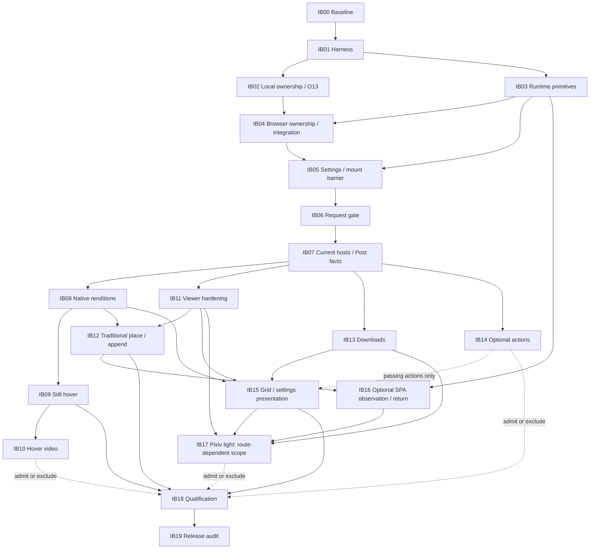

# Booru Enhancer Extended — Final Implementation Blueprint

Version 1.0 · 26 September 2026 · Authoritative implementation handoff · **No implementation or further validation executed in producing this document.**

## 1. Executive implementation strategy

Evolve the pinned **v1.2.7.3 master, commit `6f06dfd19fe916be784fd6bafe6dce6ed76503fe`**, one checkpoint at a time. Preserve the native gallery and useful master behavior. Correct ownership, runtime, settings and request invariants before activating dependent changes. Integrate narrowly into existing sections; do not replace the userscript with a new application.

### Authority and evidence snapshot

Inputs, in the user's required precedence order:

| Priority | Controlling input | Recorded SHA-256 |
| --- | --- | --- |
| 1 | [Architecture_Reconciliation_Report.md](Architecture_Reconciliation_Report.md) | `4679545d9b5dcf6bbc1cb7152e4675f61575cdc87a98d9f0b21b1658904d1df5` |
| 2 | [Pre_Implementation_Validation_Gate_Plan.md](Pre_Implementation_Validation_Gate_Plan.md) | `531c6d40f1d6669eb5f3bf15ba771cc7e982545f36c7e7e445f11fdb79852b24` |
| 3 | [EC0_EC1_Evidence_Ledger.md](EC0_EC1_Validation_v1/EC0_EC1_Evidence_Ledger.md) | `740ac43c8d9455bf39ebb3f2fb4a42af2807186e8c8353e63265a806d903c425` |

Hashes are copied from the existing evidence manifest, not a new validation run. Master SHA-256: `9c432eee32b16f144f4553ae439b7097bf4b48cf6858d601f4d16b0d4e602af0`. Original Claude ZIP SHA-256: `56df21123dfd92bfabf80f0adab9855f92e5c7227b4f5b8172afa9f805aa9a45`. The [EC0/EC1 manifest](EC0_EC1_Validation_v1/manifest.json) identifies preserved source, harness, dependencies, results and fixtures.

The latest user instruction expressly requests this blueprint now. It supersedes the validation plan's procedural requirement to wait until EC7 before writing a plan; **it does not turn open gates into passes or authorize executing this blueprint in this task**. Architecture decisions remain reconciled. Evidence statuses come from the newer ledger, superseding the plan's earlier initial-status snapshot. The prescribed validation cards still govern future evidence collection.

| Current fact | Binding consequence |
| --- | --- |
| EC0 identities established; original master/harness unchanged | Use them as the recovery baseline, not a moving upstream branch. |
| V6-L O01–O12 pass locally; O13 leaves focus on BODY after removing a focused owned control | G-OWN is blocked. Correct and demonstrate this narrow contract before new DOM-mutating feature integration. No framework expansion. |
| Common runtime probe exists; preparation is incomplete | Preserve its hash/results; extend one common revision only for missing V5-P cases. |
| TC, VC, TF, VF all **OPEN—NOT RUN** | No cross-browser or manager capability claim. No installed version is assumed. |
| No live Rule34/e621/e926/Gelbooru observation | No host metadata path or selector is live-certified. Native fallback remains possible without an API strategy. |
| V9-M captured current settings and indistinguishable empty stores | No fresh-install detector may infer history from `{}`. No production migration exists yet. |
| EC2 not started | Every future gate closure needs new, recorded evidence; this document executes none. |

### Execution semantics

**IB00–IB19 are implementation checkpoints; EC0–EC7 remain evidence checkpoints. They are different identifiers and neither implies completion of the other.** Each IB specification below contains all fourteen required fields. The sequence is the default order; dependencies determine eligibility. If an optional branch is blocked, record its exclusion or unresolved status and select the next independent eligible checkpoint. Never work on two implementation checkpoints simultaneously.

Some checkpoints contain an **E stage** followed by a **P stage**. E is the smallest isolated experiment needed to close a premise in the validation plan. P is the bounded production integration. An activation gate listed as “E → PASS before P” must be recorded before that integration begins; it is not an assumption, a self-issued pass from code existence, or permission to execute feature code on live pages. After P, the actual production artifact must demonstrate conformance to that contract. A prototype pass alone does not pass the checkpoint.

Three work states apply throughout:

| State | Allowed work | Boundary |
| --- | --- | --- |
| **Before a gate** | Read source, specify contracts, sanitize captured fixtures, qualify assertions; authorized isolated E-stage probes under the validation plan | No dependent production activation or support claim. Live account mutation requires its own named authorization. |
| **Disabled capability** | Only the checkpoint's admitted pure logic or proven narrow helper, unreachable from automatic startup, event binding and network admission | No shadow requests, source assignments or temporary migrations. A hidden button is not a disabled capability. No speculative host transport before its evidence gate. |
| **After a gate** | Integrate the exact measured scope and verify the actual candidate artifact | A pass is keyed to host/route/context, media class, cell/mode, source/grants and test conditions. It does not spread to neighboring rows. |

A disabled skeleton is not mandatory preparation. Prefer leaving unvalidated capability absent. Runtime/source boundaries are conceptual responsibilities inside **one distributed `.user.js`**. Existing `_GM`/`BE.gm`, `BE.store`, `BE.settings`, `BE.net`, `BE.adapters`, `BE.core`, `BE.naming` and feature/init sections are the starting points. This blueprint does not require a file split, bundler migration, new dependency framework or site-by-browser adapter multiplication.

Evidence classes remain distinct: source-confirmed; synthetic/harness-confirmed; external documentation/application source; architectural policy; and directly observed live runtime. Test logs must name their class. Existing EC1 Node/jsdom results cannot certify media cancellation, BFCache, autoplay, browser worlds, manager saved-file completion or live selectors.

## 2. Authoritative checkpoint sequence

| ID | Checkpoint | Why it is here / completion boundary |
| --- | --- | --- |
| IB00 | Baseline and recovery | Freeze source/evidence and preservation obligations before any edit. |
| IB01 | Qualify the permanent assertion harness | Trust the tests before using them to justify fixes; historical defects stay historical. |
| IB02 | Correct O13 and finish local ownership evidence | The smallest known hard failure; isolated probe only. |
| IB03 | Runtime primitives and minimal compatibility boundary | Real storage/request/menu semantics precede browser ownership and settings integration. |
| IB04 | Browser ownership and bounded production disposal | Close G-OWN, then establish production ownership before new mutating features. |
| IB05 | Settings schema, migration and mount barrier | Resolve effective preferences before feature startup changes. |
| IB06 | Small enhancer-HTTP request gate | Centralize finite attempts/cancellation before changing host resolution. |
| IB07 | Current-host metadata, Post facts and scope corrections | DOM-first, host-specific policy; no blind family fallback. |
| IB08 | Reversible native rendition integration | Correct e621 picture behavior before selecting larger hover sources or relying on layout. |
| IB09 | Still-image hover dwell and cost | Admit measured useful previews without pointer-triggered large unknown loads. |
| IB10 | Muted hover-video lifecycle | Admit only validated source/cell classes; complete source cleanup. |
| IB11 | Existing viewer hardening | Preserve transforms/playback choices and make takeover/loading/failure safe. |
| IB12 | Tiered place restoration and bounded traditional append | Depends on identity, ownership, layout and viewer return; no reconstruction. |
| IB13 | Download lifecycle and honest outcomes | Runtime and site transport evidence precede save claims and work-page downloads. |
| IB14 | Validated native actions | Optional, independently gated; generic mutation never returns. |
| IB15 | Grid and restrained settings/surface presentation | Expose established capabilities without deleting functional controls. |
| IB16 | SPA route observation and native-return boundary | Separate runtime question needed by route-dependent Pixiv, not traditional boorus. |
| IB17 | Pixiv light adapter | Last new adapter, after its actual ownership/runtime/rendition/place/download/page gates. |
| IB18 | Cross-runtime and site qualification | Qualify one frozen artifact using explicit intersections and exclusions. |
| IB19 | Release audit and handoff | Provenance, notices, sanitation, recovery and support claims agree with evidence. |

IB02 and IB03 are not mutually dependent: if real browsers are unavailable after local work, qualified fixture work can finish but IB04 remains blocked. IB13 can proceed without hover-video admission once its own prerequisites pass. IB14 and IB16–IB17 are optional branches; a failed favorite or missing SPA signal must not hold otherwise qualified booru viewing hostage. IB18 selects a release scope explicitly; omission is never reported as a feature pass.

## 3. Full checkpoint specifications

The tests listed below supplement, and do not replace, the corresponding V1–V9 cards and R1–R8 execution packs. Every new assertion must detect a known failing baseline or deliberate fault. Shared requirements: deterministic local tests; isolated storage and teardown; sanitized evidence; no live quota discovery; no production preference experiments; preserve exact candidate/grants/environment identity. “Rollback” always means the checkpoint's change and affected capability, never deletion of user data or reactivation of a known unsafe behavior.

### IB00 — Baseline and recovery

1. **Objective:** Establish an immutable recovery point and auditable scope before editing.
2. **Invariant established:** Every later change is attributable to the pinned master and a declared preservation/change obligation.
3. **Exact production scope allowed:** None. Prepare a working checkout from the pin, preserving original artifacts outside the edit target.
4. **Exact production scope forbidden:** Upstream rebasing, source fixes, dependency upgrades in the historical harness, settings writes, new host matches.
5. **Prerequisites:** All three controlling documents and EC0/EC1 packet accessible; recovery destination selected.
6. **Evidence gates already PASS:** EC0 file-identity evidence must match the selected inputs. No runtime/live gate required or implied.
7. **Files/modules expected to change:** New implementation manifest, recovery instructions and baseline inventory only; pinned source/ZIP/logs remain read-only.
8. **Master behavior unchanged:** Every §6 row, including valid advanced settings and action surfaces.
9. **Required tests:** Future identity/recovery verification; inventory thirty settings and existing surfaces. Do not run known harmful live probes.
10. **Acceptance criteria:** Commit/hash and original harness identities recorded; working copy distinguished from pin; source rollback and preference-backup recovery documented; selected host/runtime candidate scope recorded.
11. **Failure/rollback condition:** Missing/mismatched input stops implementation; locate intended artifact rather than silently adopting latest source.
12. **Evidence/artifacts produced:** `IB00` manifest, preservation inventory, recovery record and input links.
13. **Gates opened for later checkpoints:** Baseline eligibility for IB01; no G-* capability changes.
14. **Checkpoint ID/name:** IB00 — Baseline and recovery.

### IB01 — Qualify the permanent assertion harness

1. **Objective:** Make regressions demonstrable without rewriting the historical evidence.
2. **Invariant established:** A passing assertion detects its targeted defect; baseline defect observations and corrected behavior have distinct result labels.
3. **Exact production scope allowed:** None. New separate test runner/fixtures can target extracted master sections or an isolated working-copy build.
4. **Exact production scope forbidden:** Editing Claude's ten files/ZIP/logs to go green; relabeling O13 as acceptable; changing production to accommodate a weak test.
5. **Prerequisites:** IB00; original T1–T10 and EC1 artifacts, including both O01 oracle versions and O13.
6. **Evidence gates already PASS:** Baseline identity only. Existing failures are inputs, not a reason to fabricate G-OWN.
7. **Files/modules expected to change:** Separate test directory, explicit assertion entry point, dependency lock, fixture loader and result schema. Existing harness dependency may remain historical; lock new suite independently.
8. **Master behavior unchanged:** Production byte identity and §6 baseline; known defects remain visible until their assigned checkpoint.
9. **Required tests:** Qualify startup fan-out, hover amplification, native titles/picture/click, download overlap, false favorite, append liveness, video source retention and generic-host exclusion assertions; add missing idol negative fixture. Preserve EC1 sensitivity tests. Use fake clocks for retry liveness and close all test resources.
10. **Acceptance criteria:** Repeatable local runner exits; test failures are correctly classified; each new oracle has a failing control. Harness can be accepted while production-contract tests report explicit expected baseline failures—never “all production regressions passed.”
11. **Failure/rollback condition:** Non-sensitive assertion or unexplained nondeterminism blocks reliance on that test; correct the oracle with before/after evidence, not the expectation to hide a defect.
12. **Evidence/artifacts produced:** Historical-to-permanent test mapping, fault-control results, runtime/lock metadata, known-failure register.
13. **Gates opened for later checkpoints:** Trustworthy local verification for IB02 onward; no live gate.
14. **Checkpoint ID/name:** IB01 — Qualify the permanent assertion harness.

### IB02 — Correct O13 and complete local ownership evidence

1. **Objective:** Resolve the smallest failing focus/disposal contract and finish V6-L in an isolated probe.
2. **Invariant established:** Disposal removes only owned effects; removing a focused owned control returns focus to a surviving native origin without stealing focus after the user/native page moved it.
3. **Exact production scope allowed:** None. Correct the minimal local ownership probe and assertions only, in a new evidence revision.
4. **Exact production scope forbidden:** New feature integration, generalized reactive owner, global focus manager, production viewer rewrite, editing v1 failure artifacts.
5. **Prerequisites:** IB01; O13 native-link → owned-button → dispose sequence and retained-target evidence.
6. **Evidence gates already PASS:** Qualified local oracle/baseline only. G-OWN remains blocked until IB04's browser evidence.
7. **Files/modules expected to change:** New revision of isolated owner, focus fixtures and V6-L tests; no master change.
8. **Master behavior unchanged:** Entire production artifact. Focus policy must preserve later native focus and usable native navigation.
9. **Required tests:** O01–O13 with actual owner focus return, not a post-test repair; focus moved elsewhere; origin removed/replaced; repeated disposal; native card replacement/moved source; repeated and equal-value native edits; late callbacks; disabled-hover labels/equivalent accessible replacement; append failure versus full disposal. Retain original node identities.
10. **Acceptance criteria:** O13 passes on candidate and fails on a missing-return mutant. Remaining V6-L cases pass or explicitly restrict the unsupported mutation. No BODY drop when the designated native origin survives. Missing origin uses a declared surviving native target; otherwise disclose reload recovery, never fabricate restoration.
11. **Failure/rollback condition:** Stop at smallest owner failure. Reduce/avoid the problematic mutation; no richer framework to mask it. Do not move to new DOM integration.
12. **Evidence/artifacts produced:** Versioned V6-L candidate/results, focus sequence, mutation/cleanup counts, negative controls, supported-effect list.
13. **Gates opened for later checkpoints:** Local prerequisite for IB04; **not** full G-OWN or browser focus acceptance.
14. **Checkpoint ID/name:** IB02 — Correct O13 and complete local ownership evidence.

### IB03 — Runtime primitives and minimal compatibility boundary

1. **Objective:** Establish the runtime behaviors actually available in a real target cell, then normalize only those primitives.
2. **Invariant established:** One userscript uses an async-facing runtime contract; API absence, cancellation, progress and persistence are described honestly and remain independent of site adapters.
3. **Exact production scope allowed:** E: complete/run one common V5-P probe revision. P: narrow wrappers around storage, fetch/privileged requests and menus; returned handle retention, single settlement, logical cancellation and optional progress. Download/route capability entries may initially say unavailable/unvalidated; their implementations activate only at IB13/IB16. Existing feature wiring stays unchanged here.
4. **Exact production scope forbidden:** Site parsers, endpoint budgets/retries, broad media scheduling, active downloads/history hooks, page bridge, browser-specific editions, substitution of localStorage for GM storage.
5. **Prerequisites:** IB01; real disposable profiles and controlled two-origin transport. IB02 need not be passed to measure non-mutating primitives.
6. **Evidence gates already PASS:** E entry: baseline/test qualification. **G-RUNTIME(cell, primitive/mode), E → PASS before P integration of that primitive.** Unavailable optional behavior can have a tested degradation contract; it is not a feature pass.
7. **Files/modules expected to change:** Common probe/server/tests; `_GM`/`BE.gm`, narrow `BE.store`/`BE.net` transport boundary, menu helper. No site-by-manager modules.
8. **Master behavior unchanged:** Serialized preference meaning, grants unless explicitly justified/retested, feature defaults and native UI. No premature mount using default values.
9. **Required tests:** Full V5-P/R1–R2 primitive cases: both exposed API forms; malformed/denied storage; same-origin and privileged cross-origin; redirects/headers/body/auth errors; timeout; known/unknown/zero-total/error progress; handles before await; abort ignored/late callback/Promise races; menu callback/reinit/dispose. Record server close separately from logical cancellation. Existing EC1 probe covers only a subset.
10. **Acceptance criteria:** At least the selected development cell has measured primitive contracts and actual wrapper conformance. Others remain open until tested. Persistence failure does not claim saved settings; non-abortable work is tracked until terminal/declared timeout, not assumed wire-cancelled.
11. **Failure/rollback condition:** Withhold affected wrapper/cell capability or use a tested native fallback. Revert narrow wiring; no version guesses or browser fork.
12. **Evidence/artifacts produced:** Per-cell version/grants/modes record, common probe hash, primitive timelines, raw/sanitized logs, capability limitations and wrapper conformance.
13. **Gates opened for later checkpoints:** Scoped G-RUNTIME; IB04/05/06 and later download experiments. Does not close G-ROUTE/G-DOWNLOAD-R.
14. **Checkpoint ID/name:** IB03 — Runtime primitives and minimal compatibility boundary.

### IB04 — Browser ownership and bounded production disposal

1. **Objective:** Validate the minimal owner in a browser, then apply it to existing lifecycle boundaries.
2. **Invariant established:** Every integrated effect has an idempotent disposer; native state/identity, accessible labels, safe clicks and focused return survive, subject to documented missing-target fallback.
3. **Exact production scope allowed:** E: V6-B on controlled native-concurrency fixtures. P: narrow owner records/closures at existing card, viewer-shell and init/dispose boundaries; register existing listeners/timers/observers and generation checks; correct unsafe title removal and synchronous takeover ordering. Do not yet change rendition policy or add features.
4. **Exact production scope forbidden:** Broad reactive framework, cloned native subtrees, universal DOM snapshot restoration, new adapters or media/append policy changes; claiming an attribute-value comparison identifies a same-value native write.
5. **Prerequisites:** IB02 local acceptance; IB03 primitive evidence in the executing cell; disposable browser fixtures.
6. **Evidence gates already PASS:** G-RUNTIME for the used lifecycle/transport primitives. **G-OWN(named effects, cell), E → PASS before P.** Production conformance is then separately mandatory.
7. **Files/modules expected to change:** Small owner helper; existing init/card decoration/hover title/viewer-open and disposal sections; isolated browser tests.
8. **Master behavior unchanged:** Viewer transforms, ordinary click-to-view choice, native modifiers/middle/actions, toolbar functions, saved settings. Ordinary append failure still retains readable content.
9. **Required tests:** V6-L/B including actual focus/navigation, O13, native moved/replaced nodes, same-value writes, responsive-source identity, synchronous shell failure and later native-link fallback; five cycles; late callback/source reassignment; cleanup counts; full disposal versus feature failure. Test actual integrated call sites.
10. **Acceptance criteria:** No native data loss, dead click, stale resurrection or orphan listener; disposal returns surviving focus without overriding later user focus. Native changes invalidate stale restoration. Unsupported effects remain unperformed; reload-dependent recovery is explicit.
11. **Failure/rollback condition:** Disable/revert the affected mutating call site immediately. G-OWN reopens for its dependent features; unrelated read-only/runtime work can continue.
12. **Evidence/artifacts produced:** Scoped G-OWN record, production owner inventory, DOM-reference/focus/click timelines, browser evidence and conformance diff.
13. **Gates opened for later checkpoints:** New DOM-mutating integration for named effects/cells; no blanket permission for every future effect.
14. **Checkpoint ID/name:** IB04 — Browser ownership and bounded production disposal.

### IB05 — Settings schema, migration and mount barrier

1. **Objective:** Preserve effective choices while introducing schema versioning and reliable initialization.
2. **Invariant established:** Preferences resolve before preference-dependent effects mount; a migration is idempotent, recoverable and cannot infer installation age from an empty store.
3. **Exact production scope allowed:** E: migration model and isolated GM round-trip/mount tests. P: schema version distinct from product version; validated migration/import/export, inert unknown-key preservation, non-destructive recovery and awaited initialization. Hide the no-op retry control only when IB15 changes presentation; retain its raw key inertly.
4. **Exact production scope forbidden:** Silent fresh-install classification, production-store trial migrations, erasing hidden/unknown values, changing valid viewer/grid preferences, mounting with temporary new defaults.
5. **Prerequisites:** IB03 storage; IB04 mounting/disposal contract; M01–M06 and thirty-key source schema.
6. **Evidence gates already PASS:** G-RUNTIME(storage/cell), G-OWN(mount lifecycle). **G-SETTINGS via V9-M + V5-O, E → PASS before P activation.**
7. **Files/modules expected to change:** `BE.store`, `BE.settings`, init ordering, settings import/export; isolated migration fixtures and barrier tests.
8. **Master behavior unchanged:** All valid explicit choices and absent legacy defaults. Ambiguous empty stores use legacy booru defaults, including Sample and append-on as stored intent; capability admission still controls execution.
9. **Required tests:** Six EC1 fixture classes, repeated migration, both available storage forms, delay/denial/partial write, unknown imports/raw keys, invalid boolean/numeric/select values, malformed exports, schema newer than supported, and first mount timestamp. Failed migration must not partially overwrite production preferences.
10. **Acceptance criteria:** Explicit policy: unknown keys remain inert and round-trip; malformed values are safely isolated/preserved for recovery and resolved to documented legacy-safe defaults, never treated as valid arbitrary types. An unsupported newer schema remains untouched and blocks dependent migration/mount rather than being down-converted. `{}` never proves new. Auto/append-off applies only with established provenance or explicit user choice. A marker first written during this upgrade is not proof of prior freshness. Migration failure prevents dependent mount and retains native access.
11. **Failure/rollback condition:** Keep prior store/last known effective configuration; suppress rollout or run clearly session-only where tested. Stop on data loss or transient-default mounting. No destructive down-migration.
12. **Evidence/artifacts produced:** Key-by-key migration table, input/output/unknown-value snapshots, recovery format, idempotence and mount-barrier traces, G-SETTINGS record.
13. **Gates opened for later checkpoints:** Settings-dependent feature initialization and presentation. No unmeasured new numeric defaults.
14. **Checkpoint ID/name:** IB05 — Settings schema, migration and mount barrier.

### IB06 — Small enhancer-HTTP request gate

1. **Objective:** Replace compounded retry/fallback and abandoned work with one finite logical-operation policy.
2. **Invariant established:** All enhancer HTTP uses one entry; one attempt budget owns transport/fallback; equivalent reads share work until their last consumer releases; each consumer settles once.
3. **Exact production scope allowed:** E: V5-Q finite model and controlled transport. P: gate in `BE.net`/call boundaries; endpoint concurrency/spacing, Retry-After/cooldown, foreground/background queues, queued promotion, dedupe, consumer counts, logical cancellation, typed outcomes and small breakers. Existing call sites adopt the entry without inventing new host strategies.
4. **Exact production scope forbidden:** Resource leases, native image/video admission, decode quotas, generalized fairness/subscriptions, cross-tab coordination, independent nested retry loops, automatically retried ambiguous mutations. Manager file attempts are not routed through a fabricated byte scheduler.
5. **Prerequisites:** IB03 runtime; IB05 settings/init; IB04 for callbacks into owned UI; qualified historical retry tests.
6. **Evidence gates already PASS:** G-RUNTIME(request/cell), G-SETTINGS, G-OWN for UI consumers. **G-REQUEST via V5-Q, E → PASS before HTTP integration.**
7. **Files/modules expected to change:** `BE.net`, logical-operation call boundaries, in-flight read table, endpoint-policy inputs; no universal scheduler package.
8. **Master behavior unchanged:** Explicit viewer/download actions and useful cache/coalescing; native page/media networking; no new traffic to preserve defective retry behavior.
9. **Required tests:** R3; both A/B release orders queued/running/cooldown; viewer joins/promotes hover; last release; ignored abort; late success/error/timeout; key A cooldown leaves B usable; shared budgets and finite attempts across fetch/GM/HTML; auth bodies including HTTP 200; visible sentinel cannot restart a terminal job.
10. **Acceptance criteria:** Foreground precedes queued background without preempting active work; optional background starvation is allowed. Read identity includes site/account/operation/parameters; mutations never join read dedupe. Logical cancellation does not release an unresolved non-abortable transport's concurrency occupancy as though the wire stopped. No 401/403/404/auth/structural automatic retries; transient reads have finite attempts. Outcomes distinguish success/auth-required/not-found/rate-limited/transient/structural/cancelled. Numeric host budgets remain evidence-derived.
11. **Failure/rollback condition:** Withhold affected HTTP integration; retain native access. Correct the narrow gate fault; do not restore unbounded retries as fallback.
12. **Evidence/artifacts produced:** Admission/attempt/cooldown/consumer timelines, fault controls, real abort subset, endpoint-key contract and G-REQUEST record.
13. **Gates opened for later checkpoints:** Bounded host resolution and metadata for later features; no host endpoint approved by gate mechanics alone.
14. **Checkpoint ID/name:** IB06 — Small enhancer-HTTP request gate.

### IB07 — Current-host metadata, Post facts and scope corrections

1. **Objective:** Stop family-wide request assumptions while retaining existing dedicated paths as evidence-gated candidates.
2. **Invariant established:** Native facts come first; missing facts resolve only for an admitted need through a validated strategy; unknown remains unknown.
3. **Exact production scope allowed:** E: V1-N/X in priority order Rule34, e621, e926, Gelbooru. P: host-specific resolver policies; no startup/append HTML fan-out; auth/body classification; bounded cache and negative results; minimal Post/four-slot normalization; account invalidation. Remove generic favorite mutation and the four explicitly excluded matches. Narrow donmai wildcard activation to admitted gallery hosts. Safeguard shutdown of known unsafe paths may precede a replacement strategy.
4. **Exact production scope forbidden:** Unverified API/HTML fallback activation, guessed CDN/extension cascades, credential UI, e926→e621 visibility bypass, universal content graph/Collection/Relationship Edge/cursor, current-phase readmission of rule34.us/Sankaku.
5. **Prerequisites:** IB04–IB06 for production integration; passive V1-N can be gathered independently when authorized. No live captures currently exist.
6. **Evidence gates already PASS:** G-OWN, G-RUNTIME, G-REQUEST, G-SETTINGS for enabled behavior. **G-HOST(exact route/context/strategy), E → PASS before that resolver is implemented and wired.** Native-only exclusion needs no fictitious API pass; new DOM extraction still requires observed markup.
7. **Files/modules expected to change:** `BE.adapters`, family host policies, `BE.core` Post normalization/cache, startup enrichment, match/activation allowlist and generic action dispatch.
8. **Master behavior unchanged:** Dedicated candidate code not deleted merely for neatness; valid native URLs/links, viewer access using available facts, saved host preferences and functional surfaces. Excluded hosts receive an explicit release/migration notice.
9. **Required tests:** T1/T2 desired assertions; no unauthorized retries/fan-out; one selected on-demand read; exact identity validation; 200-auth/login/malformed bodies; cache expiry/account switch; partial merge versus explicit invalidation; original bytes never assigned to distinct sample; live host strategy and route evidence.
10. **Acceptance criteria:** Rule34 same-origin DAPI and documented API origin distinguished; no imported 60/60 HTML budget. Gelbooru key-required path not blindly probed. Safebooru/other hosts retain separate unknown policies. Post has site/id/native URL/kind/count/naming facts and thumbnail/sample/original/poster optional facts; DOM/credentials stay out. Signed URLs are short-lived in memory, not durable settings/place data.
11. **Failure/rollback condition:** Disable only unvalidated strategy/capability; DOM/native fallback, otherwise untouched native page. Do not force HTML because API failed. Parser damage or wrong identity stops that host path.
12. **Evidence/artifacts produced:** Per-host native/endpoint ledger, slot provenance fixtures, cache/attempt traces, explicit exclusions and G-HOST records.
13. **Gates opened for later checkpoints:** Measured host facts for renditions/hover/place/download/actions; other retained hosts remain candidates until separately scoped admission.
14. **Checkpoint ID/name:** IB07 — Current-host metadata, Post facts and scope corrections.

### IB08 — Reversible native rendition integration

1. **Objective:** Preserve whole-image/native responsive behavior while selecting useful sources only where validated.
2. **Invariant established:** Enhancement preserves native source/picture identity, current preferences and responsive behavior; disposal never overwrites newer native choices.
3. **Exact production scope allowed:** E: V9-R on e621, independently e926, and admitted Danbooru routes. P: minimum picture treatment, native size/rendition selection and restoration; sufficient native grid facts avoid redundant metadata. Prefer leaving sources intact; any necessary neutralization must meet G-OWN.
4. **Exact production scope forbidden:** Cloning/deleting native source trees, unconditional srcset removal, global cookie override, new crop mode, broad URL rewriting, Pixiv adapter integration here.
5. **Prerequisites:** IB04, IB05, IB07 host identity/facts; native currentSrc/viewport/DPR observations.
6. **Evidence gates already PASS:** G-OWN(picture/native attributes), G-SETTINGS, G-HOST and relevant G-RUNTIME. **G-RENDITION(host/pattern), E → PASS before source/size integration.**
7. **Files/modules expected to change:** Existing e621 thumbnail-quality application, adapter rendition methods, grid style/source boundary; native preference fixtures.
8. **Master behavior unchanged:** Contain/whole-image intent, fixed columns/gap/size, valid quality choices, native account/page controls. Hiding ineffective quality controls does not erase their value.
9. **Required tests:** Same picture/source/img references before/after; two viewport/DPR conditions; dispose then resize/currentSrc; native edit/moved source/replacement; malformed rendition fallback; Danbooru native size/query/cookie effect and restoration. No live result inherited between e621/e926.
10. **Acceptance criteria:** Actual responsive selection and native preference survive; adapter declares source identity/cost provenance. Larger tile does not falsely claim a sharper underlying image. Unsupported patterns remain native.
11. **Failure/rollback condition:** Stop that source mutation and leave native rendition; retain setting inertly. A reload-only limitation cannot be reported as transparent reversible integration.
12. **Evidence/artifacts produced:** G-RENDITION records, node/currentSrc traces, viewport/DPR screenshots, native preference/restoration record.
13. **Gates opened for later checkpoints:** Layout/rendition premises for IB09 and IB12; Pixiv pattern evidence is a separate later scope.
14. **Checkpoint ID/name:** IB08 — Reversible native rendition integration.

### IB09 — Still-image hover dwell and cost

1. **Objective:** Make accidental pointer movement cheap while keeping known inexpensive originals useful.
2. **Invariant established:** No new hover metadata request or upgraded media source assignment precedes dwell; eligibility depends on measured cost/provenance, not slot names.
3. **Exact production scope allowed:** E: V2 pilot/frozen allowance/held-out examples. P: existing hover's dwell/cancel, cheapest sufficient still selection, local staged replacement, generation guard and one negative-cached validated derivation. Known low-cost animated-image classes require their own whole-resource eligibility; video is IB10.
4. **Exact production scope forbidden:** Per-hover HEAD, extension/host guessing, universal original ban, unrestricted original-only exception, automatic unknown large animation, global decode/native-byte scheduler, numeric limits chosen by intuition.
5. **Prerequisites:** IB04–IB08 for selected host/class; operator usefulness and cost allowance decision from V2.
6. **Evidence gates already PASS:** G-OWN, G-RUNTIME, G-REQUEST, G-SETTINGS, G-HOST, G-RENDITION. **G-HOVER(class), E → PASS before automatic upgrade activation.**
7. **Files/modules expected to change:** Existing hover handler, slot eligibility helper and adapter-declared rendition facts; local lifecycle tests.
8. **Master behavior unchanged:** Hover setting, native label when disabled/no accessible replacement, whole-image intent, explicit View, cheap original-only usefulness.
9. **Required tests:** Fake-clock dwell/40 ms sweeps; no pre-dwell network/source assignment; leave/reentry/viewer joins; wrong-slot bytes and aliases; known cheap original/sample/unknown/animated classes; V2 throttled and unthrottled pilot and held-out usefulness/transfer observations. Test parameters 100/180/300 ms are experiments, not preset product defaults.
10. **Acceptance criteria:** Recorded chosen dwell/byte/dimension policy fits frozen allowance on held-out cases. Unknown originals retain thumbnail/View; unknown-byte sample needs validated preview-class evidence. Current target's placeholder remains until its replacement is ready; stale same-ID generation cannot apply.
11. **Failure/rollback condition:** Fall back to thumbnail/View for affected class; preserve validated classes and saved choice. Cost-inconclusive class stays disabled; do not broaden fetching to improve a score.
12. **Evidence/artifacts produced:** G-HOVER records, parameter rationale, slot/cost ledger, admission timings, paired visual observations and negative controls.
13. **Gates opened for later checkpoints:** Tested still-preview classes and cost allowance for video evaluation; no automatic video admission.
14. **Checkpoint ID/name:** IB09 — Still-image hover dwell and cost.

### IB10 — Muted hover-video lifecycle

1. **Objective:** Retain useful streamed previews where transfer and cleanup evidence permits them.
2. **Invariant established:** Hover video is always muted, dwell-gated and class-eligible; leaving before or after readiness releases every owned source and prevents resurrection.
3. **Exact production scope allowed:** E: V3 controlled/live class tests. P: fix current hover-video pause/detach/reset on leave/close/dispose and stale play/readiness handlers; choose observed cheaper stream; keep a bounded active hover element count. Poster fallback elsewhere.
4. **Exact production scope forbidden:** Native video scheduling, hard byte-cap claims from pointer duration, guessed 480p/720p URLs, ugoira/whole-archive processing, forcing viewer mute from hover policy.
5. **Prerequisites:** IB04 lifecycle, IB07/08 source facts, IB09 cost definitions; controlled video and representative live class evidence. Controlled V3 preparation can precede IB09's final live class pass, but activation cannot.
6. **Evidence gates already PASS:** G-OWN(media effects), G-RUNTIME, G-REQUEST for metadata, G-SETTINGS, G-HOST/G-RENDITION, relevant G-HOVER cost allowance. **G-VIDEO(class, cell), E → PASS before automatic playback integration.**
7. **Files/modules expected to change:** Existing hover video lifecycle/source selection and local media cleanup helper; class capability record.
8. **Master behavior unchanged:** Hover video remains a feature in passing classes; viewer autoplay/mute/loop choices remain separate; native media and deliberate View remain reachable.
9. **Required tests:** T9 desired assertions; leave before/after loadeddata/first frame; five reentries; late play/readiness; all owned src/source paths; Range/no-Range/fast-buffering, MP4/WebM and lower-cost variants. V3 server/network traces include five seconds after leave and distinguish cached/completed/prebuffered transfers. Use the plan's declared experimental bounds, not a universal guarantee.
10. **Acceptance criteria:** No stale reattachment, orphan active elements or audible hover; measured transfer fits frozen class policy. DOM source removal alone never proves bytes stopped. Both controlled lifecycle and representative live eligibility are recorded.
11. **Failure/rollback condition:** Disable automatic video only for failing class/cell; cheaper validated sample or poster/View. Correct narrow cleanup defect; no global resource machinery.
12. **Evidence/artifacts produced:** G-VIDEO record, source/event/network timeline, bytes/cache/prebuffer findings and local regression results.
13. **Gates opened for later checkpoints:** Muted hover in measured classes; no G-PLAY claim until viewer preference cases pass.
14. **Checkpoint ID/name:** IB10 — Muted hover-video lifecycle.

### IB11 — Existing viewer hardening

1. **Objective:** Make current viewer takeover and staged media loading reliable without replacing its interaction model.
2. **Invariant established:** The viewer shows the selected target's usable placeholder, preserves transformations/preferences and offers native recovery when loading or playback fails.
3. **Exact production scope allowed:** Stage target thumbnail/sample before ready upgrade; retain post-ID plus generation guards; local loading/buffering/failed/blocked-Play states; safe shell takeover and native link; cleanup and focus return. E-stage V3 playback precedes changes to playback handling.
4. **Exact production scope forbidden:** Viewer rewrite, replacement gallery shell, global media accounting, forced remute over explicit preference, loading old post image as new target, page-reader abstraction.
5. **Prerequisites:** IB04/05/07 and applicable runtime/host facts; reusable local media cleanup. IB09/10 passing automatic preview classes are not prerequisites for deliberate viewer loading.
6. **Evidence gates already PASS:** G-OWN(viewer), G-RUNTIME, G-SETTINGS; G-REQUEST/G-HOST for enhanced metadata. **G-PLAY(cell), E → PASS before playback-policy wiring.** Unavailable playback has a tested Play/native fallback, not autoplay certification.
7. **Files/modules expected to change:** Existing viewer `open`/post update/media handlers, local image readiness, transform-preserving replacement, error/Play controls.
8. **Master behavior unchanged:** Fit modes, zoom, pan, rotation, flip, navigation/keybinds, enabled/click choice, autoplay/mute/loop/remember-volume; modified/middle/native-action clicks.
9. **Required tests:** Synchronous open throws before cancellation; later media failure after takeover; rapid different/same-ID loads; close before decode; load fallback where decode absent; all transforms across replacement/resize; V3/R8 preference combinations, deliberate unmute, rejected play and usable fallback; keyboard/focus/native-link browser checks.
10. **Acceptance criteria:** Existing interaction regressions pass; no blank uncommunicated failure, stale target or invalid transform reset. Original deliberate view is distinct from hover cost eligibility. Native navigation remains usable after failure; playback wording matches evidence.
11. **Failure/rollback condition:** Revert affected staging/playback integration or disable its capability while preserving native link and saved preferences. A failed hover class must not disable an otherwise valid deliberate viewer.
12. **Evidence/artifacts produced:** Viewer behavior/transform comparison, G-PLAY evidence, source-generation and takeover/focus timelines, failure screenshots.
13. **Gates opened for later checkpoints:** Stable last-viewed identity/focus for IB12 and viewer page navigation reuse in IB17.
14. **Checkpoint ID/name:** IB11 — Existing viewer hardening.

### IB12 — Tiered place restoration and bounded traditional append

1. **Objective:** Return users to useful native context with the reconciled minimum tiers.
2. **Invariant established:** Native restoration wins when sufficient; corrections are bounded and stop on user navigation input; append never requires reconstructing earlier pages.
3. **Exact production scope allowed:** E: V4-T acceptance. P: tier 0 last-viewed card/opener fallback; tier 1 session anchor/native-page correction; tier 2 validated page-addressable append association and optional URL replacement preserving native `history.state`; finite append failure handling and native paginator recovery. Tier 3 means no SPA history ownership; its optional existing-card correction waits for IB16.
4. **Exact production scope forbidden:** Reconstruction journal, fetching preceding appended pages on return, generalized GalleryPage/cursor, SPA push/replace writes, indefinite settling correction, append on non-addressable routes.
5. **Prerequisites:** IB04/05/06/07/08/11 for claimed route; native page identity and rendition/layout evidence. Existing cursor token does not prove page-addressable restoration.
6. **Evidence gates already PASS:** G-OWN, G-RUNTIME, G-SETTINGS, G-REQUEST, G-HOST, G-RENDITION. **G-PLACE-T(route, tier), E → PASS before that restoration/append tier activates.** No G-ROUTE dependency for traditional navigation.
7. **Files/modules expected to change:** Existing viewer close/last-viewed record, bounded session anchor helper, adapter native-page mapping, appender guards/failure state.
8. **Master behavior unchanged:** Native pagination/history payloads, viewer navigation, saved legacy append preference, existing appended readable content after ordinary failure. Unavailable append retains its preference inertly.
9. **Required tests:** V4-T: A→C viewer close; missing C/opener fallback; observed BFCache and fresh-load Back; native page 3 contains anchor; no earlier-page fetches; duplicate URL visits; layout/image settling; input interrupts correction. At most initial plus one settle correction. Deterministic append 403/429/malformed/duplicate/loop/end cases run beyond all retry windows.
10. **Acceptance criteria:** Operator accepts native-page and duplicate-URL limitations; no unrelated-card jump. Native `history.state` remains intact. Failure stops appending and reveals paginator without deleting readable additions; explicit full disposal follows G-OWN focus/recovery contract. New Auto/append-off policy obeys IB05 provenance.
11. **Failure/rollback condition:** Disable failing tier 2/route and retain native pagination/restoration. If tier 0/1 fails, narrow to surviving opener/native behavior; do not add a journal to force acceptance.
12. **Evidence/artifacts produced:** G-PLACE-T record, navigation/BFCache/state/anchor/network trace, correction counts and limitation acceptance; appender liveness results.
13. **Gates opened for later checkpoints:** Traditional append and return claims; measured place primitives for IB16/17 without SPA history rights.
14. **Checkpoint ID/name:** IB12 — Tiered place restoration and bounded traditional append.

### IB13 — Download lifecycle and honest outcomes

1. **Objective:** Eliminate timer-triggered overlapping fallback and align download wording with actual runtime guarantees.
2. **Invariant established:** One explicit download operation owns one file attempt at a time and its outcome; uncertain completion is never converted to success or an automatic second dispatch.
3. **Exact production scope allowed:** E: V8-R and V8-S for selected current hosts. P: runtime download normalization; per-file/page single-flight coordination across surfaces; optional progress, honest state transitions, native handoff, deliberate retry and filename cleanup. Metadata resolution uses the HTTP gate; manager transfer internals do not.
4. **Exact production scope forbidden:** Eight-second fallback while first outcome unknown, nested retries, save claims from anchor dispatch, ZIP packaging, bulk/search download, byte-acquisition framework, header/permission bypass.
5. **Prerequisites:** IB03–IB07; authorized small download tests and dedicated directory; source URL/header facts. Hover/video/place are not required for this independent branch.
6. **Evidence gates already PASS:** G-RUNTIME, G-OWN(controls), G-SETTINGS, G-REQUEST, G-HOST. **G-DOWNLOAD-R(cell, mode), then G-DOWNLOAD-S(site, cell), E → PASS before corresponding integration.** Tested native handoff can be a narrower scope; not a save-completion pass.
7. **Files/modules expected to change:** Existing download handler, runtime download wrapper, `BE.naming`, shared start lock/status controls; original-open handoff.
8. **Master behavior unchanged:** Filename templates/ID fallback, delimiter/max-character settings, original-open mode, thumbnail/post/viewer/toolbar download access. Ineffective retries key stays inert rather than becoming a new user-facing retry policy.
9. **Required tests:** V8/R7: >12-second controlled transfer, 8-second point with one dispatch, permission denied/cancel/terminal error/late success/redirect; callback and Promise overlap; UI plus controlled file length/digest; indeterminate progress; required live referrer/session; missing filename fields/separators and page naming.
10. **Acceptance criteria:** Distinct unavailable/dispatched-handoff/progress/manager-reported-completion/failed-cancelled/unknown outcomes. Stronger save wording only where proved. A separate explicitly confirmed retry after unknown outcome must warn the earlier attempt may finish and be recorded as a new user operation; it is never an automatic fallback or a claimed no-duplicate guarantee. Known-active attempts remain shared/locked.
11. **Failure/rollback condition:** Native original link or measured handoff mode; withhold rich status/transport. Do not recover by re-enabling overlap. Retain saved naming/preferences.
12. **Evidence/artifacts produced:** G-DOWNLOAD-R/S records, event/request/dispatch counts, redacted header/redirect trace, controlled digest evidence, UI wording table.
13. **Gates opened for later checkpoints:** Qualified current-host downloads and runtime transport prerequisite for Pixiv; no Pixiv pages/headers inferred.
14. **Checkpoint ID/name:** IB13 — Download lifecycle and honest outcomes.

### IB14 — Validated native actions

1. **Objective:** Offer only trustworthy favorite convenience on named current adapters.
2. **Invariant established:** A confirmed result comes from authoritative site semantics; one site/account/post pending lock covers every enhancer surface; ambiguity stays unknown without replay.
3. **Exact production scope allowed:** E: V7 local state/lock fixtures, passive native traces and separately authorized one-item action. P: narrow per-adapter favorite toggle and shared pending state/invalidation for passing current-host scopes; native action/page fallback.
4. **Exact production scope forbidden:** Scraped generic GET mutation, success from HTTP 200/login text, automatic ambiguous retry, queued toggle replay, votes, generalized action graph, Pixiv bookmark feature expansion in the initial light adapter.
5. **Prerequisites:** IB04–IB07 and exact action/state evidence; explicit permission naming site/account/item/action and permitted reversal before live mutation.
6. **Evidence gates already PASS:** G-OWN, G-RUNTIME, G-REQUEST, G-SETTINGS, G-HOST. **G-ACTION(site/action/context), E → PASS before shortcut integration.** Account-dependent scope without authorization remains excluded.
7. **Files/modules expected to change:** Adapter action/result validation, small shared pending lock, existing grid/viewer/post/toolbar favorite views, account-state invalidation.
8. **Master behavior unchanged:** Read-only gallery/viewer/download access and native action/editor remain. Suppress a duplicate post favorite only when equivalent native control is usable; do not remove the entire post action bar.
9. **Required tests:** V7: three surfaces simultaneous; known/unknown/pending; login/CSRF/malformed/ambiguous local responses; native state change; account switch/generation; no old-account result; distinct posts independent; authorized confirmation and optional authorized restoration.
10. **Acceptance criteria:** One mutation attempt for a shared pending target, no blind replay, all surfaces reflect confirmed final state or unknown. Failed validation removes the enhancer shortcut, not other functions.
11. **Failure/rollback condition:** Hide/disable that shortcut and expose native action. Never restore generic fallback. Stop live mutation on ambiguity; no unauthorized “cleanup” toggle.
12. **Evidence/artifacts produced:** G-ACTION row, authorization record, sanitized before/result/after state, lock/account timeline, omission list.
13. **Gates opened for later checkpoints:** Optional favorite on passing scopes; no requirement that every retained host have an enhancer action.
14. **Checkpoint ID/name:** IB14 — Validated native actions.

### IB15 — Grid, settings and action-surface presentation

1. **Objective:** Expose the established capabilities clearly while preserving useful master controls.
2. **Invariant established:** Basic/advanced disclosure changes visibility, not effective preferences or reachability of admitted functions.
3. **Exact production scope allowed:** Organize existing settings into restrained basic/advanced groups; preserve size/fixed columns/gap; label square tiles accurately; condition quality controls on effect; factual media/count labels from existing facts; contextual thumbnail/post/floating controls, collapse and placement. Remove no-op retry control while retaining its key inertly.
4. **Exact production scope forbidden:** New crop/provider/filter/account systems, network enrichment solely for badges, silent toolbar/function removal, unsolicited native preference overwrite, settings proliferation from donors.
5. **Prerequisites:** IB04/05, admitted IB07/08 capability records and applicable completed feature checkpoints. Optional omissions remain explicit.
6. **Evidence gates already PASS:** G-OWN(UI), G-SETTINGS; each exposed functional capability's existing gate. G-RENDITION for effective quality changes; G-ACTION only for favorite controls; missing optional gate means native fallback/omission, not blanket block.
7. **Files/modules expected to change:** Existing settings UI, grid CSS/layout inputs, thumbnail action bar, post bar, floating toolbar and contextual capability checks.
8. **Master behavior unchanged:** Fixed columns, gap, size, theme/accent, toolbar position, keybinds, open mode; SauceNAO reverse search; post Download/Open original/Fullscreen/Reverse Search/Info; thumbnail View/Download/Open original; floating Settings/Viewer/Download/Open original/Prev/Next where meaningful.
9. **Required tests:** §6 preservation checklist with stored nondefaults; hide/show/re-enable; keyboard/focus/collapse/reinit/dispose; native control clicks; unknown badges omitted; zero badge-only requests; ineffective control retains raw preference; no-op retry control absent.
10. **Acceptance criteria:** Every preserved function is reachable or has an explicit capability restriction/native alternative; no preference lost when a control is hidden. Existing whole-image behavior is not advertised as a new crop fix where source remains cropped.
11. **Failure/rollback condition:** Revert presentation change that removes reachability or alters settings; retain validated functional work. No architecture expansion to make the settings screen simpler.
12. **Evidence/artifacts produced:** Before/after surface map, settings disclosure/value table, screenshots/accessibility checks, completed preservation rows.
13. **Gates opened for later checkpoints:** Stable UI baseline for qualification; no new host/media gate from cosmetic acceptance.
14. **Checkpoint ID/name:** IB15 — Grid, settings and action-surface presentation.

### IB16 — SPA route observation and native-return boundary

1. **Objective:** Determine whether actual page-router changes can be observed safely in each intended Pixiv runtime cell.
2. **Invariant established:** Route observation never takes ownership of SPA history or changes page state/arguments/return behavior; missing observation disables dependent behavior.
3. **Exact production scope allowed:** E: V5-R page-originated router/CSP tests and V4-S settled native return. P: smallest measured runtime route notification/lifecycle capability; bounded correction only to an existing native card after native return. A narrow signal-only bridge is allowed only if E proves it necessary and validates it.
4. **Exact production scope forbidden:** Assuming granted-world pushState patch reaches the page; enhancer SPA history writes; privileged functions/credentials/executable payloads in bridge; reconstructing cards; Pixiv append.
5. **Prerequisites:** IB03/04/05, IB12 bounded place contract; actual Pixiv route facts for live V4-S; common fixture revision and real managers. Native read-only inspection needs no new production adapter.
6. **Evidence gates already PASS:** G-RUNTIME, G-OWN, G-SETTINGS; G-HOST for live route identity. **G-ROUTE(cell/route class), then G-PLACE-S(route/cell), E → PASS before respective P wiring.** Traditional support is independent.
7. **Files/modules expected to change:** Runtime route capability, existing init/disposal routing boundary and bounded place callback; common page-side router/CSP fixtures.
8. **Master behavior unchanged:** Traditional booru navigation and native router state; no patch replaces a later native patch during disposal; existing viewer/settings behavior.
9. **Required tests:** R4/V5-R: page-originated push/replace/pop, late router, subtree replacement, actual grants/world/default/reachable CSP fallbacks, argument/return/state equivalence and cleanup; V4-S native settled return, missing target, user input, zero enhancer history writes.
10. **Acceptance criteria:** Measured route coverage in exact cell, no stale owner or privilege exposure. If signal unreliable, a separately proven settled initial-route-only mode or untouched native behavior; no false SPA-support badge.
11. **Failure/rollback condition:** Keep route capability unavailable; omit route-dependent Pixiv behavior. Do not disable traditional boorus or introduce history writes to compensate.
12. **Evidence/artifacts produced:** G-ROUTE/G-PLACE-S records, page/probe event comparisons, CSP/injection/grants metadata, native history/return trace, bridge necessity record if applicable.
13. **Gates opened for later checkpoints:** Exact route-dependent scope for IB17; no Pixiv content/transport permission by itself.
14. **Checkpoint ID/name:** IB16 — SPA route observation and native-return boundary.

### IB17 — Pixiv light adapter

1. **Objective:** Improve admitted native still-work routes with restrained decoration and explicit work-page navigation/downloads.
2. **Invariant established:** Pixiv remains the native application; each enabled feature consumes measured native facts and established core/runtime contracts.
3. **Exact production scope allowed:** E: narrowly bounded V1/V9-R/V8-S still-work/page/header evidence. P: native-card decoration, verified aspect-preserving rendition, still metadata, lazy `adapter.getPages(post, signal)` returning ordered page slot sets with stable index/key, existing viewer previous/next page, selected separate-file downloads through IB13. Default native click until that adapter's takeover is validated.
4. **Exact production scope forbidden:** Infinite scroll/append, SPA history writes, ugoira/archive processing, reader, generated-class card reconstruction, generic bookmark/privacy handling, Collection/Relationship Edge/cursor, ZIP/range packaging.
5. **Prerequisites:** IB04–IB08, IB11–IB13, IB15; IB16 for route-dependent behavior. Obtain Pixiv evidence with isolated read-only/selected download probes, not by prematurely building the adapter.
6. **Evidence gates already PASS:** G-OWN, G-RUNTIME, G-SETTINGS, G-REQUEST; **Pixiv-scoped G-HOST, G-RENDITION, G-PAGES, G-DOWNLOAD-R/S**, and **G-ROUTE/G-PLACE-S for SPA behavior**, all before P implementing their dependent feature. Relevant G-HOVER/G-VIDEO additionally required if exposed; no automatic inheritance from boorus.
7. **Files/modules expected to change:** One Pixiv site adapter and native-card binding; only minimal existing viewer page navigation/download integration; exact match/connect permissions supported by evidence.
8. **Master behavior unchanged:** Existing booru viewer/grid/toolbar/settings; native Pixiv bookmark/privacy/editor and routing; page-one preview with known count, no hover page flip.
9. **Required tests:** Single/multi-page native count/order; missing/expired URLs; selected two-page download permission/header/naming; known square/master mapping plus unmatched/error fallback; native rerender without clone; page change/close cancellation and generation; exact runtime intersections. Safe takeover remains native if unvalidated.
10. **Acceptance criteria:** All enabled subfeatures have Pixiv-specific gates and production conformance. Full checkpoint claim includes admitted page navigation and referer-correct downloads. If page/download/route gate fails, explicitly exclude that subfeature or defer this checkpoint; a reduced single-page/native-only release is not described as full Pixiv support. Initial-settled-only mode requires proof of safe disposal/disable on later changes and no SPA-correction claim.
11. **Failure/rollback condition:** Native work/card/link for affected scope; disable adapter effects that cannot safely observe lifecycle. Do not add richer page models or unsupported headers to force passage.
12. **Evidence/artifacts produced:** Pixiv route/pattern/page/header matrix, gate references, conformance tests, source/license intake record and explicit exclusions.
13. **Gates opened for later checkpoints:** Only measured Pixiv still-work capability rows for IB18; none of the deferred Pixiv branches.
14. **Checkpoint ID/name:** IB17 — Pixiv light adapter.

### IB18 — Cross-runtime and site qualification

1. **Objective:** Turn individual contracts into accurate claims about one candidate userscript.
2. **Invariant established:** Every enabled release capability has passing premise and production-conformance evidence for its actual site/route/context/runtime/media scope, or is explicitly withheld.
3. **Exact production scope allowed:** Freeze candidate; minimal capability exclusions/allowlist or release-metadata corrections only. A discovered functional defect returns to its owning checkpoint before requalification.
4. **Exact production scope forbidden:** New features, browser editions, bulk live stress, blanket family/platform inference, claiming an unexecuted mode passed.
5. **Prerequisites:** IB00–IB15 for selected core scope; optional IB14/16/17 admitted or explicitly excluded. Completed checkpoint records and recovery artifact.
6. **Evidence gates already PASS:** All gates required by each proposed row in §5/§8; partial scopes never promote open rows. No “all gates everywhere” requirement for excluded optional capabilities.
7. **Files/modules expected to change:** Candidate manifest, exact common userscript artifact, support/degradation matrix, release docs; code fixes use prior checkpoint discipline.
8. **Master behavior unchanged:** Entire §6 preservation matrix for enabled scopes; retained preferences and native fallbacks on excluded ones.
9. **Required tests:** Same artifact/hash and applicable R1–R8 cases in TC/VC/TF/VF; exact versions/modes/permissions; shared pure tests plus necessary live site/runtime intersections; upgrade/import/dispose regressions; preserved surface behavior. Reuse evidence only with a stated unchanged-contract basis.
10. **Acceptance criteria:** Every proposed release row is PASS for its claimed capability or EXCLUDED with tested truthful degradation. OPEN/FAIL mandatory row blocks that claim. No four-platform badge unless all required cells pass. Artifact/grant change reopens affected gates and joins.
11. **Failure/rollback condition:** Hold release claim, narrow capability with explicit record, or reopen owning checkpoint. Do not patch one runtime edition and retain common-artifact results.
12. **Evidence/artifacts produced:** Frozen hash/build identity, per-cell and per-site capability ledger, production regression report, change-to-evidence invalidation map, approved exclusions.
13. **Gates opened for later checkpoints:** Release audit for the chosen qualified scope, not automatic publication.
14. **Checkpoint ID/name:** IB18 — Cross-runtime and site qualification.

### IB19 — Release audit and implementation handoff

1. **Objective:** Produce a reviewable release candidate whose code, evidence, notices and claims agree.
2. **Invariant established:** Distributed source includes required provenance/notices, no sensitive evidence, and no unsupported capability claim or scope leak.
3. **Exact production scope allowed:** License/notice and version/release-metadata corrections; final recovery/support documentation. Any functional correction reopens its owning checkpoint and affected qualification.
4. **Exact production scope forbidden:** Feature additions, widening @match/@connect, dropping notices, unreviewed donor translation, publishing/deploying solely because this blueprint exists.
5. **Prerequisites:** IB18 qualified artifact and §9 provenance register; all selected checkpoint handoffs complete.
6. **Evidence gates already PASS:** Required gates for every included release row; explicit exclusions and their degradation evidence retained. Final artifact metadata changes receive affected requalification.
7. **Files/modules expected to change:** Installed userscript notices/header, source intake register, release notes/support matrix, recovery instructions and sanitized evidence index.
8. **Master behavior unchanged:** §6 obligations except documented approved changes; no removal hidden in a version/notice patch.
9. **Required tests:** §10 release criteria audit; distributed notice inspection, no secrets/private URLs in package, permissions/match allowlist review, checkpoint scope-diff audit, final preservation/conformance evidence currency and reproducible artifact identity.
10. **Acceptance criteria:** One distributable userscript; notices travel with it; supported-host/runtime rows match evidence; operator/user-facing limitations and recovery clear; no required unresolved gate or unrecorded production change.
11. **Failure/rollback condition:** Withhold release; quarantine uncleared source/material or remove adaptation, then requalify affected code. Do not relabel uncertain license or runtime evidence as accepted.
12. **Evidence/artifacts produced:** Release candidate, final evidence index/support matrix, provenance/notices register, sanitation audit, release notes and rollback/handoff record.
13. **Gates opened for later checkpoints:** Ready for separate release approval/execution under that workflow's authority; no deferred feature admission.
14. **Checkpoint ID/name:** IB19 — Release audit and implementation handoff.

## 4. Checkpoint dependency graph

Arrows express prerequisites, **not permission for simultaneous implementation**. Gate checks inside checkpoints additionally constrain the exact enabled scope. Optional branches may be explicitly excluded; a required invariant such as ownership cannot be waived for an effect still performed.

For IB15, completing a particular feature checkpoint is required only to change/expose that feature's presentation; no new favorite can appear from a failed IB14. IB18 requires the actual chosen viewer/download/presentation branches even where the graph's transitive edges abbreviate them. An excluded hover/append capability still needs verified native fallback and preserved stored intent. An explicitly proven initial-route-only Pixiv subset may omit route-dependent behavior; it does not bypass ownership, native lifecycle safety, rendition or download requirements for features it enables.

The critical foundation chain is **IB00 → IB01 → IB02 and IB03 → IB04 → IB05 → IB06**. The present next implementation-workflow task is IB00, then harness qualification. It must not jump straight from twelve passing EC1 cases to feature integration. Passive host observation and isolated primitive evidence can be scheduled as the active evidence task without awaiting unrelated optional features, but one active implementation checkpoint remains the rule.

## 5. Evidence-gate-to-checkpoint matrix

Current status is copied from EC0/EC1; “first closure” means a **future responsibility**, not work done by this blueprint. Each closure includes artifact conformance after the E-stage premise. Refer to the validation plan for full case definitions and safety limits.

| Evidence gate | Current state | Evidence owner / first closure opportunity | Production work blocked until scoped PASS | Allowed narrower result |
| --- | --- | --- | --- | --- |
| G-OWN | **Blocked: O13 local failure; browser evidence open** | IB02 V6-L; IB04 V6-B and actual integration | New DOM effects in IB05–17, including picture/controls/media | Avoid effect; untouched native behavior; explicit reload fallback only where disclosed, not a fake reversible pass |
| G-RUNTIME | **TC/VC/TF/VF OPEN—NOT RUN** | IB03 V5-P, R1/R2; IB18 affected cells | GM-dependent integration for each primitive/cell | Tested unavailable/session-only/native fallback; no manager-specific edition |
| G-REQUEST | OPEN | IB06 V5-Q/R3 | All enhancer HTTP integration/resolver work | Withhold enhanced network capability; native links |
| G-SETTINGS | OPEN; fixtures only | IB05 V9-M + V5-O/R1 | Migration activation, changed defaults, preference-dependent mount | Preserve legacy effective choices; no default rollout; tested session-only if appropriate |
| G-HOST | OPEN for all four priority hosts/routes/contexts | IB07 V1-N/X; Pixiv extension at IB17 E | Metadata beyond observed DOM, host/path claims, dependent features | Verified DOM-only subset; otherwise native-only. API failure does not certify HTML |
| G-RENDITION | OPEN | IB08 V9-R; Pixiv pattern at IB17 E | Native source/size/quality mutation and relevant preview/place premise | Native source/preference, hidden ineffective control with stored value retained |
| G-ROUTE | OPEN | IB16 V5-R/R4 | Route-dependent Pixiv decoration/cleanup and SPA correction | Independently safe initial-route-only mode or native; traditional boorus unaffected |
| G-HOVER | OPEN | IB09 V2 | Automatic still/animated-image source classes and numeric policy | Thumbnail/View; inexpensive originals admitted only with actual supporting facts |
| G-VIDEO | OPEN | IB10 V3 + V2 allowance/R5 | Automatic hover video for class/cell | Passing cheaper source, otherwise poster/View; keep passing video elsewhere |
| G-PLAY | OPEN | IB11 V3/R8 | Claims about viewer playback choices and autoplay degradation | Play/native controls, stored preference retained; no forced mute over explicit choice |
| G-PLACE-T | OPEN | IB12 V4-T/R6 | Traditional correction tiers; especially tier-2 append | Lower passing tier/native restoration/pagination |
| G-PLACE-S | OPEN | IB16 V4-S after G-ROUTE | Existing-card SPA return correction | Native SPA return; zero enhancer history writes |
| G-ACTION | OPEN | IB14 V7 for current-host action scopes | Enhancer favorite shortcut on exact action/account/runtime intersection | Omit shortcut; native action/page. No false state confirmation |
| G-DOWNLOAD-R | OPEN | IB13 V8-R/R7 | Download mode, completion/cancel/retry wording | Verified handoff/unknown contract; no saved-file assertion |
| G-DOWNLOAD-S | OPEN | IB13 V8-S; Pixiv extension at IB17 E | Site-specific enhanced file transport | Native original link/handoff where validated |
| G-PAGES(Pixiv) | OPEN | IB17 E, V1/V8-S | Ordered page navigation/count and selected work-page downloads | Single-page/native work scope expressly labeled, or defer adapter |

No feature is allowed to promote a weaker evidence class. For example, G-VIDEO needs actual media/network evidence even if G-OWN source-detachment assertions pass. G-DOWNLOAD-S needs the site's headers/session/redirect requirements even if the loopback GM request passed. G-ACTION needs authoritative state and authorization even if its parser fixture passed.

Runtime failure is capability-scoped: one cell's unavailable progress does not disable image viewing in all cells. Conversely, source/grant/world changes can invalidate many dependent rows; the implementer must reopen them explicitly. A per-tab gate does not claim to enforce an unknown account/IP-wide quota.

## 6. Master-behavior preservation matrix

This is an acceptance contract, **not a claim the pinned feature passed live today**. “Preserve” means retain valid behavior and effective saved intent while correcting named defects; the defect itself is not a compatibility requirement.

| Master behavior / default | Required preservation | Explicitly permitted change / owner | Required proof |
| --- | --- | --- | --- |
| Fixed columns (`gridDensity` 0/automatic by default) | Explicit column count remains functional | Advanced disclosure only, IB15 | Nondefault column fixture plus actual layout |
| Grid gap 8, thumbnail size 220, compact false | Saved values survive; size is distinct from columns/gap | Admitted native rendition integration IB08; wording IB15 | Migrations + responsive/layout comparison |
| Whole-image/contain; square tile layout | Preserve visible whole image where source contains it | Better verified rendition; “Square tiles” wording, no crop mode | Source/pattern evidence and visual case |
| Sample quality legacy default | Preserve effective Sample/original/preview intent | Auto only per IB05 established provenance/explicit choice | M01/M02/M05/M06 and live effective rendition |
| Hover enabled | Preserve choice, useful inexpensive stills and passing video classes | Dwell/cost policy and class-specific fallback IB09/10 | Pre-dwell zero-new-work; cost/lifecycle evidence |
| Native title/accessibility | Disabled/failed replacement leaves native information intact | Suppress only while accessible replacement exists, IB04 | Title/label/focus/disable tests |
| Viewer on ordinary current-booru click | Preserve enabled/disabled choice and default | Cancel only after synchronous takeover; failure native link IB04/11 | Browser click and later-failure tests |
| Modifier/middle/native action clicks | Preserve native behavior; correct interception defects | Restricted event handling IB04/11 | Protected/nested-control cases in browser |
| Fit/zoom/pan/rotate/flip/key navigation | Keep behavior and affordances | Staged target replacement only, IB11 | Transform/key/resize regression matrix |
| Viewer autoplay/mute/loop/remember-volume all default true | Preserve explicit true/false and volume choices | Browser-blocked Play/native fallback; hover independently muted | G-PLAY combinations; migration nondefaults |
| Infinite scroll legacy effective on | Keep preference, useful readable appended content | Execute only on admitted page-addressable routes; fresh-policy off only per IB05; failure stops IB12 | Finite retry/end/duplicate guards, native return/page-3 evidence |
| Reverse search | Existing SauceNAO action stays reachable | None beyond safe surface/lifecycle correction | Correct URL/action and surface check; no new provider system |
| Thumbnail action bar | View/Download/Open original retained; Favorite conditional | Omit unvalidated Favorite only | Reachability plus corresponding feature gates |
| Post-page action bar | Download/Open original/Fullscreen/Reverse Search/Info retained | Favorite duplication suppressed only if usable native equivalent | Context/keyboard/native-control checks |
| Floating toolbar | Settings/Viewer/Download/Open original/Prev/Next where meaningful; saved position | Collapse allowed; Favorite only validated | Reachability, position, collapse/reinit/dispose |
| Filename/template/open mode | Preserve effective template, character cap, delimiter, ID fallback and original-open choice | Clean missing fields; page index when required; truthful outcomes IB13 | Naming fixtures + actual controlled download behavior |
| Stored download retries=3 | Raw key retained inertly | Remove no-op control IB15; gate owns policy IB06/13 | No setting-driven phantom retry behavior |
| Theme/accent/keybinds/debug/general enable | Preserve valid effective values and hidden choices | Schema validation of malformed values only, IB05 | Thirty-key before/after table, disable/restoration |
| Import/export/unknown values | Preserve known choices; keep inert unknown values in migration/export | Correct old unknown-import dropping; quarantine malformed data IB05 | Round-trip/idempotence/recovery tests |
| Dedicated host behavior | Preserve candidates and settings; validate exact scope | Unverified capability may be disabled with native fallback | Host/context ledger; no family inference |
| rule34.us and three Sankaku matches | Stored preferences remain | Explicit removal this phase IB07; no generic actions | Exclusion fixtures including idol; release note |
| Generic favorite mutation | **Not preserved** | Remove without replacing with unvalidated host toggle | Unknown-host negative tests; G-ACTION for replacements |
| Native history and navigation | Native authority retained | Bounded traditional replacement preserves existing state; no SPA writes IB12/16 | Actual state/Back/BFCache/route trace |

Behavior changes must be recorded against these rows. If a runtime cannot perform a previously exposed action, explain the unavailable capability and preserve its saved preference. Do not claim “simplified settings” as authorization to remove fixed columns, gap, reverse search or entire action surfaces.

## 7. Deferred-feature admission table

These are future admission triggers, **not work packages or permission to create scaffolding now**. The present blueprint ends at IB19. Reopening requires a separate scoped decision supported by a demonstrated unmet requirement.

| Deferred / rejected area | Future evidence needed to reconsider | Present implementation boundary |
| --- | --- | --- |
| Universal scheduler / broad fairness | An admitted workload demonstrably fails the small two-lane endpoint gate | No abstract scheduling platform or fairness hooks |
| Resource leases / native-media scheduling / decode quotas | Measured contention or resource failure that local media lifecycle cannot resolve | No leases, decode budget registry or browser-byte scheduler |
| Subscription graph | A present consumer needs dependency semantics not served by in-flight read consumers | No generalized subscriptions; consumer count stays local |
| Collection / Relationship Edge / generalized content graph / typed plans / cursor | An admitted provider needs actual relationships/cursor semantics beyond Post and ordered work pages | No graph types or unused extension interfaces; getPages only when Pixiv consumes it |
| Reconstruction journal | V4 demonstrates an accepted required task fails the tiered model and narrower anchor correction | No page-rebuild cache/history log; no SPA ownership |
| EH/ExH/nhentai reader | Stable booru/Pixiv baseline, direct user need and named gap versus native/eHunter | No reader/site adapter/content-model scaffolding |
| FurAffinity / linked comics | Post-Pixiv demonstrated native-page benefit and validated explicit links | No FA adapter or chain model |
| Ugoira | Stable still-work support plus demand justifying archive/timing/memory lifecycle | Poster/native work only; no archive/player hooks |
| Votes | Direct demand and validated native semantics/account state | No vote controls or mutation logic |
| ZIP packaging / range download | Selected separate-file workflow proven inadequate | No archive dependency, batch acquisition or packaging pipeline |
| Pixiv append / infinite scroll | Demonstrated need plus intact native actions/routing without generated-class reconstruction | No Pixiv appender, history write or synthesized cards |
| Cross-tab coordination | Measured cross-tab throttling; actual shared quota established | Per-tab gate with documented limit; no locks/channel service |
| Hover page flipping / extra triggers | Demonstrated frequent-inspection need not met by viewer pages and current hover control | No wheel takeover or trigger-mode matrix |
| Generic unknown-site actions | No blanket readmission; only a separately admitted dedicated adapter/action | **Reject generic mutation**; unknown site remains native |
| rule34.us / Sankaku | Separate future dedicated adapter evidence/decision | No readmission in this phase |
| Safari / other managers / mobile | Explicit target admission and matching capability matrix | No forks or claimed support by analogy |

## 8. Runtime/site qualification matrix

### Runtime axis

All four cells are targets, not current certifications. Record exact browser/manager/OS, extension build/mode, permissions, common artifact hash, grants/connect, execution world, CSP path, request mode and download mode at execution. Minimum supported versions are chosen from evidence, not specified speculatively here.

| Cell | Storage/API/menu R1 | HTTP/abort/progress R2–R3 | Route/world R4 | Ownership/media R5 | Navigation/rendition R6 | Downloads R7 | Playback R8 |
| --- | --- | --- | --- | --- | --- | --- | --- |
| TC: Tampermonkey × Chromium | OPEN—NOT RUN | OPEN—NOT RUN | OPEN—NOT RUN | OPEN—NOT RUN | OPEN—NOT RUN | OPEN—NOT RUN | OPEN—NOT RUN |
| VC: Violentmonkey × Chromium | OPEN—NOT RUN | OPEN—NOT RUN | OPEN—NOT RUN | OPEN—NOT RUN | OPEN—NOT RUN | OPEN—NOT RUN | OPEN—NOT RUN |
| TF: Tampermonkey × Firefox | OPEN—NOT RUN | OPEN—NOT RUN | OPEN—NOT RUN | OPEN—NOT RUN | OPEN—NOT RUN | OPEN—NOT RUN | OPEN—NOT RUN |
| VF: Violentmonkey × Firefox | OPEN—NOT RUN | OPEN—NOT RUN | OPEN—NOT RUN | OPEN—NOT RUN | OPEN—NOT RUN | OPEN—NOT RUN | OPEN—NOT RUN |
| Safari | Deferred | Deferred | Deferred | Deferred | Deferred | Deferred | Deferred |

Use the validation plan's exact packs. A mode not exposed by an installed manager is unavailable, not an invented test execution. A mode needed by a proposed claim but not tested remains open. One common userscript revision must be used across cells; relevant changes require rerunning affected cells. No separate Tampermonkey/Violentmonkey/Chromium/Firefox editions.

The runtime boundary reports capability and normalized outcomes. Site adapters supply route/endpoint/data/auth/referrer semantics. A runtime wrapper must not contain Gelbooru selectors, and a site adapter must not branch into four manager-specific implementations. A narrow site requirement plus measured runtime capability determines eligibility.

### Site axis

Routes below are candidate shapes, not live discoveries. Every claimed row requires actual native route/ID/media/pagination facts and account-context labeling. Initial effort order is **Rule34.xxx → e621.net → e926.net → Gelbooru.com**. Other retained candidates are not forced into the initial release; neither are they silently erased from stored preferences or relabeled supported.

| Host / rule | Candidate route/path scope and boundary | Current qualification / prerequisite |
| --- | --- | --- |
| `rule34.xxx` | Native list/post `index.php?page=post&s=list/view`; DOM first; exact same-origin DAPI distinct from documented API origin; HTML only if measured | No live evidence; G-HOST required. No anonymous auth probing or inherited HTML quota |
| `e621.net` | `/posts`, `/posts/{id}`; native grid facts first; original/sample distinction, picture and action state | No live evidence; G-HOST/G-RENDITION; additional action/media/download gates per claim |
| `e926.net` | Same candidate route shape, independently observed visibility/account behavior | No live evidence; independent G-HOST/rendition; no cross-host resolution |
| `gelbooru.com` | Native list/post; key-required API unavailable absent admitted access; bounded on-demand HTML only if validated | No live evidence; DOM/native fallback until G-HOST |
| `danbooru.donmai.us` | Native grid/posts; on-demand validated JSON; native size integration | Retained candidate; G-HOST/G-RENDITION and optional action gate |
| `*.donmai.us` | Wildcard is not a finite supported gallery list | Expansion deferred; exact observed gallery allowlist only |
| `atfbooru.ninja` | Danbooru-shaped candidate, read-only | Independent host/schema/route evidence; no inherited login/action contract |
| `safebooru.org` | Family candidate, public API documentation not a live result | Independent API/HTML/auth/quota decision; G-HOST |
| `realbooru.com` | Read-only native/family-parser candidate | API policy unknown; observed DOM or validated single strategy |
| `tbib.org` | Read-only native/family-parser candidate | Independent routes/redirects/parser/pagination |
| `xbooru.com` | Read-only native/family-parser candidate | Independent host policy; no startup fallback fan-out |
| `hypnohub.net` | Read-only existing parser candidate | Engine/routes/schema must be established, not assumed DAPI |
| `konachan.com` | `/post/show/{id}`, on-demand `/post.json` candidate | Independent G-HOST; sample/identity/pagination facts |
| `konachan.net` | Same candidate shape | Independent `.net` access/filter/session evidence; no `.com` inheritance |
| `yande.re` | Native/Moebooru-shaped read-only candidate | Independent routes/sample aliases/pagination evidence |
| `lolibooru.moe` | Native/Moebooru-shaped read-only candidate | Actual availability/final host/route first; no generic substitution |
| `rule34.us` | Different engine; no dedicated admitted adapter | Remove/defer; no live re-admission campaign |
| `chan.sankakucomplex.com` | Historical generic path only | Remove/defer; exclusion assertion |
| `idol.sankakucomplex.com` | Source generic path, absent from original T10 exercise | Remove/defer; explicit missing local exclusion fixture |
| `beta.sankakucomplex.com` | Historical generic path only | Remove/defer; exclusion assertion |
| `www.pixiv.net`, actually observed native routes | New still-work/native-card adapter only, IB17 | All relevant Pixiv-specific gates; no claim now |

API/CDN resource origins are endpoint permissions under a site contract, not automatic new browsing-site adapters. Do not broaden @match/@connect because a donor mentions an origin. A tested listing/post does not imply pools, favorites, search variants, deleted/filtered results or every layout; claim the exact routes tested.

### Required site × runtime join record

Every proposed release capability gets a row with:

`site + route + context + capability + media/action class + runtime cell/mode + candidate hash/grants + gate evidence IDs + production conformance evidence + status + degradation/limitation`.

Allowed statuses: **PASS(scope)**; **OPEN—NOT RUN**; **INCONCLUSIVE**; **FAIL**; **EXCLUDED(scope, reason)**. For a checkpoint still in progress, use **PARTIAL—NOT COMPLETE**, never an unqualified pass. “Known unavailable with verified native fallback” is a pass only for that fallback contract.

Reuse pure parser/selection/migration tests for unchanged code. Measure runtime primitives in every claimed cell. Verify site-specific cookies/headers/redirects where needed; loopback success is insufficient. For action intersections, avoid unnecessary repeated account mutations; cite passive/shared transport evidence where adequate and leave the unproven intersection excluded. For media, one controlled MP4 does not certify a CDN/rendition class. For return-to-place, observe actual BFCache/fresh-load branches rather than inferring them from cache settings.

## 9. Provenance/license implementation rules

These are source-intake constraints inherited from the reconciliation, not new legal research or permission to merge donors. Preserve the master's notices and MIT-compatible distribution goal. License suitability and current technical suitability are separate checks.

1. **Before adapting code, record the selected file and transitive material.** Intake row: upstream project and exact commit/release; file/path and hash; author/copyright; governing file/header/repository license; imported helpers/assets/dependencies; copied/adapted portion; destination; required notices; independent implementation versus adaptation; reviewer/disposition. No repository-wide shorthand for mixed provenance.
2. **Ship notices with the installed userscript.** Substantial adapted MIT portions require applicable copyright and full permission/disclaimer text in a notices block carried by the `.user.js`, normally after metadata. Preserve upstream/master notices. `@license MIT` and a repository-only notices file are insufficient substitutes. Build/minification, if already used, must retain distributed notices.
3. **Fix-pixiv-thumbnails correction stands.** Pinned `c02dd0d51af722163d5895991a0f9b8e452c5826` has an independently verified MIT LICENSE, copyright 2020 Calvin Walton. It is not rejected as unlicensed. Any selected mapping/code still needs actual pattern validation, attribution and notice distribution; permission is not proof of current Pixiv behavior.
4. **Danbooru EX correction stands.** Pin `f352096c1fcfab3b98771940166c920a6dcd1c4d`, MIT, copyright 2016 evazion. Historical selectors are not live evidence. Audit selected portions and retain applicable notices if adapted.
5. **ppixiv is file-by-file.** Pin `200f4ffcec8f8c2ac160c5bc8109297bd8ca2f44` describes MIT/BSD portions and public-domain declaration for the rest. Audit every selected file, helper, asset and dependency, with its exact conditions/notices. No blanket “public domain” conclusion and no assumed equality to an unidentified compiled release. Until cleared, use behavioral findings only.
6. **Eza uses the conservative MIT path for adaptation.** Retain attribution/notice instead of assuming uniform worldwide public-domain status. Derived URL behavior still needs host evidence.
7. **GPL/unlicensed boundaries remain.** Pixiv Previewer/Plus/Downloader and re621 supply behavioral references under the present MIT-compatible choice; do not mechanically copy or translate their expression into this distribution. IBE/Sad Panda without established permission are not code donors. An independently specified behavior is not a license waiver for copied expression.
8. **Pixiv Infinite Scroll is not a ready history implementation.** Its observed null history-state/generated-class behavior is not admitted. Independently implement only the reconciled traditional page-in-view idea; substantial adapted MIT code still requires notices. No Pixiv append enters through this donor.
9. **Other donor lessons do not admit their products.** FA limiter, ppixiv stale-work handling, re621 naming/settings and eHunter/ExHentai loading/status examples are traceable behavioral references. Reader/FA scope stays deferred. Bobby's Pixiv Utils has no necessary role; no reliance until pinned and inspected under a separate need.
10. **Checkpoint and release audits both apply.** Record provenance at the checkpoint introducing a portion, then verify installed notices at IB19. Unclear permission blocks that source intake, not unrelated independent implementation. Remove uncleared material and rerun affected conformance; never relabel a translation as independent.

The reconciled source register contains the supporting license links/pins. This blueprint did not fetch new donor code, change license determinations or conduct a fresh external search.

## 10. Release criteria

Release candidate readiness requires all of the following for the **chosen, explicitly recorded scope**:

| Criterion | Required artifact / decision | Blocking condition |
| --- | --- | --- |
| Baseline and change identity | Pin, candidate hash, checkpoint commits/diffs, preservation register | Moving/unidentified baseline or unrecorded functional change |
| Ownership | O13 corrected; V6-L/B and actual production effect conformance | Any enabled effect with unresolved focus/native-state/cleanup failure |
| Settings/recovery | Schema/migration/idempotence/mount evidence; backup/recovery; conservative empty policy | Lost effective choice, guessed freshness, partial irreversible migration or default-before-mount |
| Request discipline | Finite total attempts, dedupe/consumer/cooldown/typed-outcome evidence | Unbounded loop, nested allowances, blind auth retry or misleading cancellation |
| Host admission | Exact observed route/context/strategy and typed error handling | Unverified endpoint activated, generic unknown-site action, forced HTML fallback |
| Native rendering / media | Passing source/rendition/cost/video/playback rows or explicit class fallback | Irreversible picture edits, pre-dwell new work, unmeasured costly automatic source |
| Viewer/place | Preserved transforms; safe failure; validated return tier and append behavior | Dead click, stale target, history payload loss, SPA writes or reconstruction |
| Download/action honesty | Mode/site outcome evidence; authoritative action state or native omission | Duplicate automatic dispatch, false saved/favorite success, unsafe retry |
| Existing surfaces | Completed §6 matrix and reachable advanced controls | Silent loss of columns/gap/reverse search/action bars/toolbar/preferences |
| Runtime portability | One artifact and per-cell/mode conformance or documented capability exclusion | Browser fork, unsupported platform claim, open required cell |
| Pixiv (only if included) | Actual page/rendition/route/place/download joins | Feature claimed through booru evidence or deferred scope leakage |
| Provenance and sanitation | Intake register; notices inside installed file; redacted public evidence | Uncleared source, missing notice, credentials/tokens/private signed URLs in distribution/logs |
| Qualification currency | All gate evidence linked to final relevant source/grants and conditions | Pass silently carried over an invalidating change |
| Scope and disclosure | Supported-host/capability matrix, exclusions, removed-host notes and known degradations | Omitted feature called passed, failed gate hidden, new deferred scaffolding |

Claims must distinguish: interest cancelled versus observed transport cancellation; handoff versus manager-reported completion versus controlled verified file completion; missing metadata versus confirmed absence; optional API unavailable versus runtime failure; source support versus live support. Release notes must name the deliberate rule34.us/Sankaku removal and native fallback where a retained capability is unavailable.

No mandatory unresolved gate for an enabled capability may remain. Optional exclusions do not block a narrower release if its remaining features and fallbacks pass and the chosen scope is explicitly accepted. An excluded entire runtime cell must be stated as unqualified, not marketed as portable. Safari stays deferred. A release-ready artifact is not permission to publish from this task.

## 11. Handoff protocol for the implementing developer/model

### Starting instruction

Read this blueprint and the three controlling inputs. Use the existing evidence packet as immutable history. Begin **IB00 only** in the implementation workflow; do not edit production code in the blueprint-authoring task. Do not infer authorization for live favorites/bookmarks, credentials or production-store experiments from approval of the blueprint.

### One-checkpoint transaction

For each active checkpoint:

1. **Declare the scope before editing.** Name ID, objective, invariant, exact host/route/context/cell/media subset, allowed/forbidden changes, baseline and dependency/gate records. Select one checkpoint; do not batch adjacent features into a large patch.
2. **Separate E-stage evidence from P-stage integration.** List missing gates and choose only authorized independent preparation, an explicitly disabled capability, or a blocked status. Follow the existing V-card/EC procedure when collecting future evidence. The same checkpoint may span turns, but a gate's absence cannot be hidden by an implementation stub.
3. **Record external needs at the relevant gate.** Real manager profiles/version/modes, ordinary native access, network instrumentation, dedicated test downloads, and scoped action permission are requested only when needed. No blanket credential request. If unavailable, record OPEN/INCONCLUSIVE and the resulting restriction.
4. **Make the smallest bounded change.** Extend existing master sections; record any new helper's actual current consumer. Review the diff against forbidden scope. Do not scaffold deferred architecture, transplant donor code or change unrelated defaults.
5. **Demonstrate the invariant.** Use qualified assertions with fault sensitivity, plus actual browser/site tests where required. Do not run known harmful historical patterns live. Preserve raw results separately from sanitized sharing artifacts and from historic defect logs.
6. **Verify production conformance and preserved behavior.** Passing the prototype is insufficient. Exercise the changed candidate and the affected §6 rows. Record what was not tested. If source/grants/endpoint/world changed, reopen affected evidence rather than silently reusing it.
7. **Commit/checkpoint only the reviewed scope.** Save source revision/hash, tests, provenance, artifacts and recovery notes. User settings are never the rollback substrate; restore code and retain backed-up/inert preference data with explicit recovery behavior.
8. **Return a checkpoint handoff before the next one.** Report PASS(scope), BLOCKED/FAIL, PARTIAL—NOT COMPLETE or EXCLUDED(scope). State the next eligible checkpoint and any required operator action. Finish one checkpoint before selecting another; unresolved optional work may be parked explicitly, never marked complete because a disabled function exists.

### Required checkpoint completion record

| Field | Required content |
| --- | --- |
| Identity | Checkpoint ID/name; executor/date; source before/after; common artifact/grants hash |
| Scope | Exact site/route/context/runtime/media/action subset; excluded branches |
| Invariant | Statement and direct evidence demonstrating it |
| Preconditions | Dependency records and gate IDs already passed, with evidence class/scope |
| Change | Conceptual modules and actual files/diff; allowed scope used; forbidden-scope audit |
| Tests | Candidate results, known-defect/fault controls, browser/live evidence where required, unexecuted cases |
| Preservation | Relevant §6 rows and before/after effective behavior |
| Evidence | Paths/hashes, raw versus sanitized logs, fixture/environment versions and limitations |
| Provenance | New selected source/notice entries or explicit no-donor-code statement |
| Failure/recovery | Known risks, capability shutdown/native fallback, rollback/recovery result |
| Gate transitions | Before/after scoped statuses; invalidated dependents; no inferred green rows |
| Outcome | PASS/FAIL/BLOCKED/PARTIAL/EXCLUDED with exact scope; next eligible checkpoint |

**A checkpoint is complete only when its invariant is demonstrated, acceptance tests pass, prohibited later work did not enter the change, required master behavior remains intact, and the evidence record exists.** Code presence, elapsed effort, a successful build, or an unexecuted test file satisfies none of those conditions alone.

If the implementation uncovers a contradiction, stop only the affected capability, record the smallest counterexample and select an already-authorized narrower outcome. Request a separate decision only when satisfying an admitted requirement would genuinely exceed the reconciled boundaries. Do not launch another broad architecture critique or feature survey.

This handoff prescribes future work. **No production implementation, additional EC1/EC2 execution, gate closure or release action occurred while writing it.**
